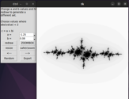
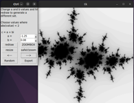
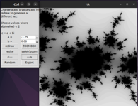
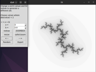
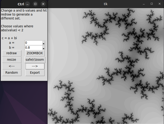
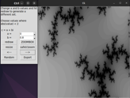
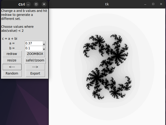
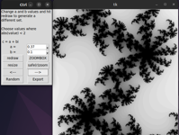
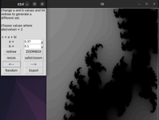
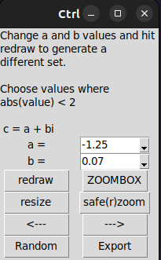

# JuliaGUI
A GUI for interactive generation, display and inspection of Julia set images. 

   

   

   

### Installation & Usage

1. **Install Dependencies:**
Ensure you have Python installed on your system. If not, download and install it from [python.org](https://www.python.org/downloads/). Then install the dependencies if you do not already have them.

    - Pillow
    - Numpy

    You can install them manually or with the following command:

    `pip install -r requirements.txt`

2. **Clone the Repository:**

    `git clone https://github.com/spookyboogy/JuliaGUI.git`

3. **Navigate to the Directory:**

    `cd JuliaGUI`

4. **Run the Program:**

    `python juliagui.pyw`

### About Julia sets

Informally speaking, normal Julia sets are defined by the holomorphic equation: 

$$ {\displaystyle f_{c}(z)=z^{2}+c~,} $$

Where, 

$$  c = a + bi : \quad -2 \leq a \leq 2 \quad , \quad -2 \leq b \leq 2 \quad  $$

While those aren't strict ranges, most recognizable Julia sets come from values within that range, as they tend to produce connected Julia sets, which correspond to points within the [Mandelbrot Set](https://en.wikipedia.org/wiki/Mandelbrot_set) at the same point (a, bi) in the complex plane. To learn more about these fascinating mathematical objects, check out the [Julia set wikipedia page](https://en.wikipedia.org/wiki/Julia_set) :)

### Using the control panel

- Redraw : After setting new value(s) for a and b, this triggers a redraw of the julia set. If a and b are unchanged, this returns to the original zoom level
- Resize : By default, images are rendered at 500px x 500px resolution. The resize button allows you to increase or decrease the resolution to your liking. Note that larger resolutions take longer to render.
- Zoombox : Select a rectangular region on the canvas to zoom into
- Safe(r)zoom : Select a (strictly) square region to zoom into. More stable/consistent than zoombox.
- <--- : Go to the previously genereated image, ie a lesser level of zoom
- ---> : Go to the next image, higher level of zoom, if it exists
- Random : Selects random values for a and b and triggers a redraw
- Export : Export the current image to a format other than .pgm  

 

