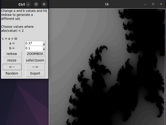

# JuliaGUI
A GUI for interactive generation, display and inspection of Julia set images. 

   

   

   

### Installation & Usage

1. **Install Dependencies:**
Ensure you have Python installed on your system. If not, download and install it from [python.org](https://www.python.org/downloads/). Then install the dependencies if you do not already have them.

    - Pillow
    - Numpy

    You can install them manually or with the following command:

    `pip install -r requirements.txt`

2. **Clone the Repository:**

    `git clone https://github.com/spookyboogy/JuliaGUI.git`

3. **Navigate to the Directory:**

    `cd JuliaGUI`

4. **Run the Program:**

    `python juliagui.pyw`
